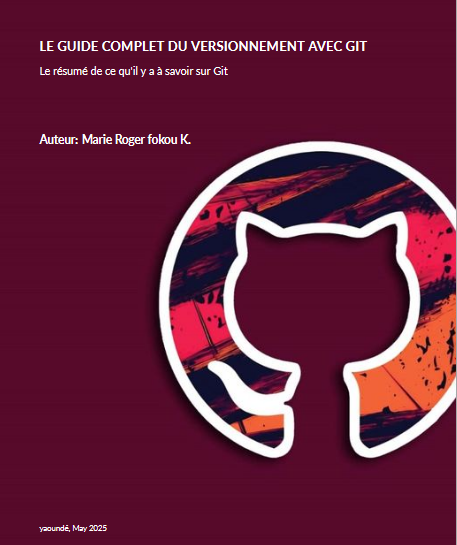

# 📘 Le guide complet du versionnement avec Git

---

## ✍️ À propos

**Le guide complet du versionnement avec Git** est un livre technique rédigé en **LaTeX** destiné aux développeurs, étudiants et passionnés qui souhaitent **maîtriser Git** et ses outils associés. Ce projet est né d une volonté de structurer et transmettre des connaissances précises, pratiques et applicables immédiatement.

> 🧠 *Un outil puissant mal compris est un danger silencieux. Ce livre vous montre comment Git devient votre meilleur allié.*

---

## 🌟 Objectifs du livre

- Comprendre le fonctionnement de Git (architecture, commandes, historique)
- Apprendre à travailler efficacement avec GitHub et GitLab
- Savoir collaborer en équipe avec Git Flow
- Appliquer de bonnes pratiques de versionnement
- Utiliser Git pour déployer des projets via GitHub Pages
- Intégrer les réflexes de base en cybersécurité liés au code versionné

---

## 📚 Contenu

Le livre est structuré en plusieurs chapitres, disponibles dans le dossier `Chapters/` :

- ✅ Introduction à Git
- ✅ Commandes de base (init, add, commit, push, pull...)
- ✅ Branches, fusions et résolutions de conflits
- ✅ GitHub & GitLab : collaboration et workflows
- ✅ Déploiement avec GitHub Pages
- ✅ Git Flow : une méthode de versionnement structurée
- ✅ bonnes pratiques
- ✅ Annexes, ressources et astuces

---

## 🌍 Langue

- 📘 Langue principale : **Français**
- 🌐 Terminologie technique en **anglais**

> Langue maternelle de l’auteur : 🇫🇷 **français**  
> Niveau en anglais : 🇬🇧 **intermédiaire supérieur**

---

## 🤝 Contribuer

Les contributions sont les bienvenues ! N’hésitez pas à ouvrir une **issue** ou proposer une **pull request** pour :

- Corriger une faute ou clarifier une explication
- Ajouter des exemples pratiques
- Suggérer des outils ou techniques à intégrer

---

## 🧑‍💻 Auteur

**Marie Roger Fokou K.**  
*web developper, passionné par la Tech, l’UI/UX et les technologies linguistiques.*

---

## 📬 Contact

- 🔗 [LinkedIn](https://www.linkedin.com/in/marie-roger-fokou-kaffo-173504290/)
- 📧 Email : Mariefk9@gmail.com

---

## 📝 Licence

Ce livre est publié sous la licence **Creative Commons Attribution 4.0 International (CC BY 4.0)**.  
Vous êtes libre de le partager, l’adapter, à condition de **citer l’auteur**.

---

## ⭐ Remerciements

Merci à tous ceux qui ont soutenu, relu, testé ou contribué à ce projet !

---
